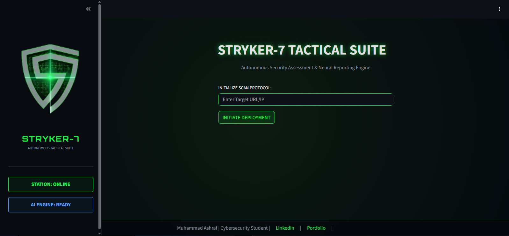

# STRYKER-7: AI-Powered VAPT Automation Platform

## Overview

STRYKER-7 is an AI-powered Vulnerability Assessment and Penetration Testing (VAPT) automation platform designed to streamline security assessments through the integration of multiple industry-standard security tools. The platform automates reconnaissance, vulnerability discovery, result aggregation, risk analysis, and professional report generation within a unified dashboard.

By combining the outputs of several security testing tools and leveraging Google's Gemini AI for intelligent analysis, STRYKER-7 helps security professionals, students, researchers, and penetration testers efficiently identify and understand security weaknesses in target environments.

---

## Key Features

* Automated multi-tool vulnerability assessment workflow
* Centralized dashboard for scan management and monitoring
* AI-assisted vulnerability correlation and analysis
* Risk categorization based on severity levels
* Automated executive summaries and technical findings
* Professional PDF report generation
* Real-time scan progress visualization
* Easy-to-use Streamlit-based user interface
* Modular architecture for future tool integration

---

## Integrated Security Tools

STRYKER-7 orchestrates and processes data from the following security assessment tools:

### Nmap

Network discovery, service enumeration, operating system detection, and version fingerprinting.

### Nuclei

Template-based vulnerability scanning for rapid identification of known security issues.

### Nikto

Web server security assessment and misconfiguration detection.

### Gobuster

Directory, file, and virtual host enumeration.

### SQLMap

Automated SQL Injection testing and database security assessment.

### WPScan

WordPress security auditing and vulnerability identification.

### OWASP ZAP

Web application security testing and vulnerability assessment.

---

## System Architecture

```text
Target Environment
        │
        ▼
 Scan Orchestrator
        │
 ┌──────┼──────┐
 │      │      │
 ▼      ▼      ▼
Nmap  Nuclei Nikto
 │      │      │
 ▼      ▼      ▼
Gobuster SQLMap WPScan
        │
        ▼
    OWASP ZAP
        │
        ▼
 Result Aggregator
        │
        ▼
 Gemini AI Engine
        │
        ▼
 Risk Analysis Layer
        │
        ▼
 PDF Report Generator
```

---

## Technology Stack

* Python 3.8+
* Streamlit
* Google Gemini API
* FPDF2
* Nmap
* Nuclei
* Nikto
* Gobuster
* SQLMap
* WPScan
* OWASP ZAP

---

## Installation

### Prerequisites

Ensure the following requirements are installed:

* Python 3.8 or later
* Git
* Internet connectivity
* Nmap
* Nuclei
* Nikto
* Gobuster
* SQLMap
* WPScan
* OWASP ZAP

---

### Clone the Repository

```bash
[git clone https://github.com/muhammadashraf181/STRYKER-7-Tactical-Suite]
cd STRYKER-7-Tactical-Suite
```

### Install Dependencies

```bash
pip install streamlit google-generativeai fpdf2
```

---

## Gemini API Configuration

To enable AI-powered analysis:

1. Visit Google AI Studio.
2. Create or log in to your Google account.
3. Generate a Gemini API key.
4. Open the ai_engine.py file.
5. Replace the placeholder value with your API key.

Example:

```python
API_KEY = "YOUR_GEMINI_API_KEY"
```

---

## Running the Application

Launch the Streamlit dashboard:

```bash
python3 -m streamlit run app.py
```

After execution, open the URL displayed in the terminal, typically:

```text
http://localhost:8501
```

---

## Dashboard Capabilities


The STRYKER-7 dashboard provides:

* Scan execution management
* Tool status monitoring
* Live scan progress tracking
* AI-generated vulnerability summaries
* Risk assessment visualization
* Professional PDF report downloads

---

## Generated Reports

The platform automatically generates professional security assessment reports containing:

* Executive Summary
* Scope of Assessment
* Identified Vulnerabilities
* Risk Ratings
* Technical Findings
* Remediation Recommendations
* Overall Security Posture Analysis

---

## Project Objectives

The primary objectives of STRYKER-7 are:

* Reduce manual effort during security assessments
* Consolidate outputs from multiple security tools
* Improve vulnerability analysis efficiency
* Simplify report generation
* Provide a user-friendly security testing platform
* Support cybersecurity education and research

---

## Disclaimer

This project is intended strictly for:

* Authorized security assessments
* Educational purposes
* Academic research
* Laboratory environments
* Professional cybersecurity training

Users are responsible for ensuring they have explicit authorization before performing any security testing activities. Unauthorized scanning or testing of systems may violate applicable laws and regulations.

---

## Future Enhancements

* CVSS scoring integration
* Asset inventory management
* Multi-target scanning support
* Vulnerability trend analytics
* SIEM integration
* Dark mode interface
* Cloud deployment support
* Advanced compliance reporting

---

## Author

**Muhammad Ashraf**

Cybersecurity Student | Digital Forensics & Cybersecurity Enthusiast

LinkedIn: https://www.linkedin.com/in/muhammad-ashraf-09873733a

Portfolio: https://muhammad-ashraf-portfolio-ten.vercel.app

---

## License

This project is released for educational and research purposes. Please review and comply with all applicable laws, regulations, and organizational policies before use.
